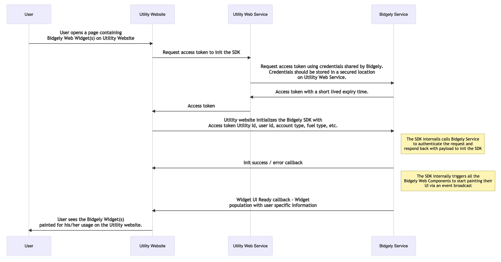

## Bidgely Web Embeddable Widgets SDK

Bidgely Web Embeddable Widgets solution provides an easy and seamless way of embedding Bidgely energy analytics Widgets as [Web Components](https://developer.mozilla.org/en-US/docs/Web/Web_Components) within a Utility hosted webpage, mobile app and popular CRM tools. Each Web Widget modularizes functionality and content, allowing for a responsive layout with configuration capabilities.

Most of Bidgely’s Web Widgets are designed to present personalized information for a single Utility Customer. The Widgets offer bite-sized Bidgely analytics to customer service apps like salesforce and SAP in order to enrich the experience for the representatives (call-center, CRM) using them.
In the following sections we illustrate the overall integration flow of the SDK on various platforms :

### Before you start

You will need to have an account with Bidgely. Please reach out to api-request@bidgely.com, specifying : 
* Your name
* Your email address
* Your company details
* Reason for your interest in Bidgely's Web Embeddable Widgets SDK

### SDK Integrations

How to integrate Web Embeddable Widgets SDK on various platforms: 

* [Get Started with Web](#integrateWeb)
* [Get Started with Salesforce](#integrateSF)

### <a name="integrateWeb"></a> Get Started with Web

Overview of integration :



#### **Step 1: Get Access Token to init the SDK** 

To initialise the SDK, you need to first acquire an access token from Bidgely service via a server-to-server API call on a secured channel. This access token has a running session expiry time of typically 30 mins which is returned along with the token as reponse to this API.

API Information : 


        GET : https://dev-api.bidgely.com/oauth/token?grant_type=client_credentials&scope=all

        Authorization Type : Basic Auth

        RESPONSE : 200 OK
        {
          "access_token": "9dd7df91-b99c-40cf-8014-dd225bdf99a8",
          "token_type": "bearer",
          "expires_in": 108000,
          "scope": "all",
          "url": "?uuid=all"
      }


You should use this access token to init the SDK and keep track of the expiry time. If the access token expires during a running client session, it can be re-requested from Bidgely service.

Once you are on-boarded to the Bidgely system, your Authorization credentials would be shared to you by Bidgely. You should keep the credentials at a secure location on your server and not bundle it with the client code. 
#### **Step 2: Integrate the SDK**

To add the Web SDK to your project, download the SDK from [here]().

1. Goto your main index.html page and import the main bundle.js & main CSS file from the downloaded .zip above.


        <html>
          <head> 
            <script src="bundle.js"></script>
            <link href="./static/css/main.css" rel="stylesheet">
          </head>
          <body>
            <!-- Utility website contents --> 
            <div class="custom-widget"> 
              <bidgely-usage-insights></bidgely-usage-insights> 
            </div>
          </body> 
        </html>

2. Set the request payload for the SDK - In order to access the Customer’s information available on the Bidgely SaaS platform, the SDK requires that the hosting service provides the proper unique customer identifiers :
    *  auth_key : Access token obtained in the previous step 
    *  utility_id :  Unique ID given to a Utility in Bidgely system
    *  user_id : Unique ID provisioned to a user in Utility system
    *  fuel_type : Type of fuel - ELECTRIC, GAS, WATER
    *  account_type : Type of account - RESIDENTIAL, SMB
    *  meter_id : ID of the meter

    The SDK is initialised with the above payload with the following code : 

        BidgelyWebSdk.initialize(BidgelyWebSdk.RUN_MODE.PROD, payload, (response) => {

          /**
          *  response = {
          *    messageType : ‘Success’ | ‘Failure’
          *  }
          */  
          
        })

    Post successful init, the SDK invokes all the Bidgely Widgets present on the web page and loads their UI.

#### **Step 3: Listen to callbacks**

You can listen to callbacks from SDK to show proper messaging to the end user while the SDK is loading the Widgets :
   * SDK Init callback 

      You can pass a callback function to the BidgelyWebSDK init API and receive status of initialization. 

      ```
      Callback Response structure :
      {
        messageType : 'SUCCESS'
      }
      OR
      {
        messageType : 'ERROR',
        data : {
          errorCode : '401',
          errorMessage : 'Unauthorized. Request parameters are invalid'
        }
      }
      ```

   * Widget UI Ready callback
     
     You can listen to UI ready events, for each individual Widget added on the page, on the same callback passed to BidgelyWebSdk init API and tune your user experience by adding / removing appropriate loaders.
     

      ```
      Callback Response structure :
      {
        messageType: 'WIDGET_UI_READY',
        data: {
          id: 'bidgely-usage-insights' // Custom tag of the Widget
        }
      }
      ```

#### **Step 3: Configure texts, colors and UI elements**
Each Web Widget supports configuration wrt strings (i18n), navigations from CTAs, fonts, colors, visibility toggling of some of the UI elements and vairous other global configurations common to all Widgets. You can fine tune each UI element on all Widgets via Configuration Sheets (templated) shared by Bidgely once you are on-boarded on the system to use the SDK.

#### **Step 4: Configure Navigation for CTAs**
Bidgley provides two ways to configure CTA navigations on all the widgets : 
1. Define the navigation link for the CTA via Configuration Sheet -
    * Absolute URL
      
      You configure the navigation link to be - https://dashboard.your-website.com/shc<br>
      Current URL location : https://dashboard.your-website.com/usage?id=1234&token=qwerty<br>
      User clicks on “See how you compare“ button on Insights Usage Widget -<br>
      A new window tab opens up with URL location : https://dashboard.your-website.com/shc“

    * Relative URL
      
      You configure the navigation link to be - “/shc“<br>
      Current URL location : https://dashboard.your-website.com/usage?id=1234&token=qwerty<br>
      User clicks on “See how you compare“ button on Insights Usage Widget -<br>
      Navigation happens on the same window to the path configured. New URL location : https://dashboard.your-website.com/shc?id=1234&token=qwerty<br>
    * Hash location

      **Case 1:**
      Utility configures the navigation link to be - “#shc“<br>
      Current URL location : https://dashboard.your-website.com/usage?id=1234&token=qwerty<br>
      User clicks on “See how you compare“ button on Insights Usage Widget -<br>
      Scroll happens on the same window to the hash location configured. New URL location : https://dashboard.electricireland.com/usage?id=1234&token=qwerty#shc<br><br>

      **Case 2**
      Utility configures the navigation link to be - “#shc“<br>
      Current URL location : https://dashboard.electricireland.com/insights?id=1234&token=qwerty#usage<br>
      User clicks on “See how you compare“ button on Insights Usage Widget -<br>
      Scroll happens on the same window to the hash location configured. New URL location : https://dashboard.electricireland.com/insights?id=1234&token=qwerty#shc<br>

    Pressing back from any of the above (except Example 1) will take the user back to previous URL location.

2. Listen to action events from the SDK and handle navigations by yourself -

    The SDK can be configured to not do a navigation when the user clicks on a CTA button but rather broadcast a navigation event with all the relevant info of the button element. You can listen to this event and handle the navigation by your own using the meta-data returned in the event like so :

    ```
    window.addEventListener('bgl-event-onlocationupdate', function(event) {
      // Custom code to handle navigation
    }, false)

    Event structure :
    {
      "element_tag": "bidgely-usage-insights",
      "event_info": {
          "event_type": "user_click",
          "redirect_to": "#shc",
          "action_label": "See how you compare"
        }
    }
    ``` 

### <a name="integrateSF"></a> Get Started with Salesforce (WIP)


[Terms of Service](https://www.bidgely.com/terms-and-conditions/) | 
[Contact Us](https://go.bidgely.com/contact-us)
